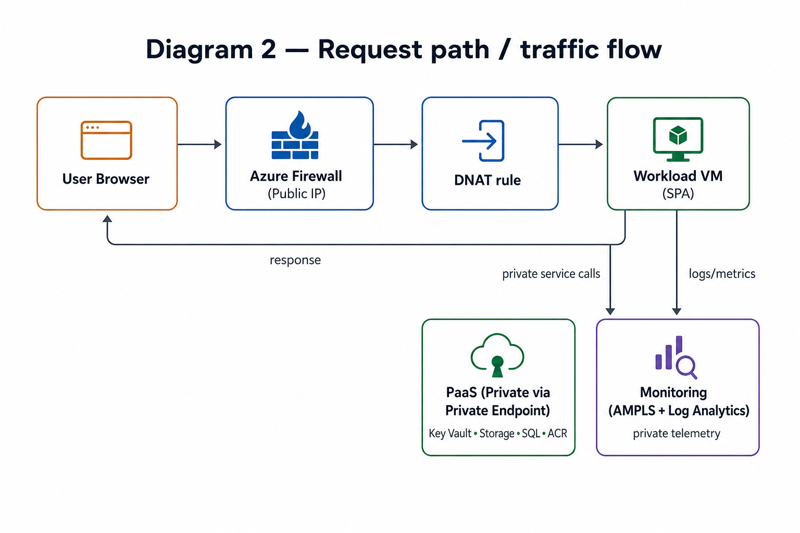
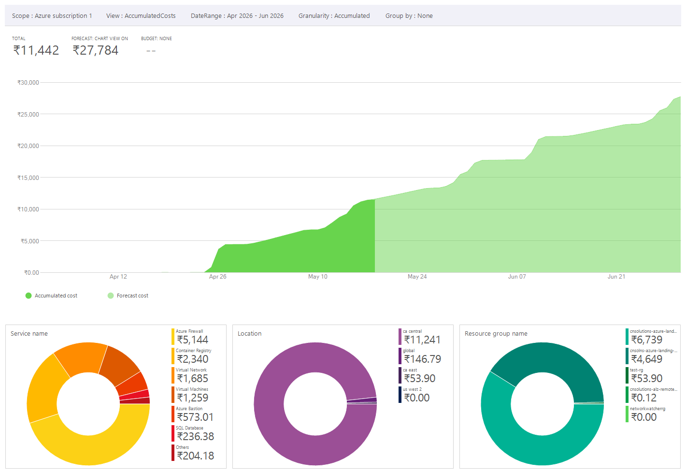

# Azure Landing Zone — Production-Grade Infrastructure on Azure

> **Terraform-based Azure Landing Zone** demonstrating enterprise networking, private-first PaaS, centralized governance, and operational observability — built to reflect real-world platform engineering standards.

---

## What This Project Demonstrates

This project provisions a **fully private, production-style Azure Landing Zone** from scratch using Terraform. It covers the full stack of concerns a Platform/Cloud Engineer owns in a real org:

| Concern | What's Implemented |
|---|---|
| **Networking** | Hub-spoke VNet topology, Azure Firewall, Bastion, NSGs, UDRs |
| **Security** | Private Endpoints + Private DNS for all PaaS, RBAC via Entra ID groups, Azure Policy |
| **Observability** | Centralized Log Analytics Workspace, AMPLS, diagnostic settings on every resource |
| **Governance** | Management Group hierarchy, policy initiatives (location + tagging + monitoring) |
| **Identity & Access** | Entra ID groups, scoped RBAC assignments, Entra-only VM login |
| **Compute** | Windows VM with managed identity, backup policy, boot diagnostics |
| **PaaS** | Key Vault, ACR, Storage Account, SQL Database — all private, all logged |
| **IaC** | Modular Terraform, remote state in Azure Storage, environment-scoped tfvars |

---

## Architecture

### Diagram 1 — High-Level Architecture


### Diagram 2 — Traffic Flow (Inbound + Private Service Calls)



---

## Network Design

### Hub VNet — `10.0.0.0/22` (1,024 IPs)

| Subnet | CIDR | Purpose |
|---|---|---|
| `AzureFirewallSubnet` | `10.0.0.0/26` | Azure Firewall (required name) |
| `AzureBastionSubnet` | `10.0.0.64/26` | Bastion Host (required name) |
| `GatewaySubnet` | `10.0.0.128/27` | Reserved for VPN/ExpressRoute |
| `private-endpoints-subnet` | `10.0.1.0/24` | All Private Endpoint NICs |
| *(reserved)* | `10.0.2.0/24` + `10.0.3.0/24` | Future expansion (512 IPs) |

> The private endpoints subnet has `private_endpoint_network_policies_enabled = false` — required for Private Endpoints to function correctly. No NSG, no UDR, no delegation on this subnet by design.

### Spoke VNet — `192.168.0.0/22` (1,024 IPs)

| Subnet | CIDR | Purpose |
|---|---|---|
| `app-subnet` | `192.168.0.0/24` | VMs, App Services, APIs |
| `database-subnet` | `192.168.1.0/24` | Self-managed DB workloads |
| `workload-subnet` | `192.168.2.0/24` | AKS, containers |
| *(reserved)* | `192.168.3.0/24` | Future expansion |

---

## Traffic Flow

### Inbound (Internet → VM)
```
Internet → Firewall Public IP → DNAT Rule (port 80/443) → VM Private IP (192.168.0.4)
```
The VM has **no public IP**. All inbound traffic is inspected and translated by Azure Firewall.

### Outbound (VM → Internet)
```
VM → UDR (0.0.0.0/0 → Firewall private IP) → Firewall App/Network Rules → Internet
```
All spoke subnets have a route table forcing outbound through the firewall. Outbound is controlled via application rules (FQDN-based) and network rules.

### Private PaaS Access (VM → Key Vault / Storage / ACR / SQL)
```
VM queries FQDN (e.g. vault.azure.net)
  → Private DNS Zone (privatelink.vaultcore.azure.net) resolves to PE NIC private IP
  → Traffic stays entirely within private network
  → Never touches public internet
```

---

## Private Endpoint + DNS — Why It Matters

Private Endpoints are only truly private if **DNS resolution is correct**. A misconfigured or missing Private DNS Zone causes workloads to silently resolve the **public** endpoint — breaking the private design without any obvious error.

This project provisions:
- A dedicated **Private DNS Zone** per PaaS service (Key Vault, ACR, Storage, SQL)
- Each zone is **linked to both Hub and Spoke VNets** — so workloads in the spoke can resolve private IPs
- DNS zones use the **exact `privatelink.*` names** required by Azure

| PaaS Resource | Private DNS Zone |
|---|---|
| Key Vault | `privatelink.vaultcore.azure.net` |
| ACR | `privatelink.azurecr.io` |
| Storage (Blob) | `privatelink.blob.core.windows.net` |
| SQL Server | `privatelink.database.windows.net` |
| Azure Monitor | `privatelink.monitor.azure.com` |
| Log Ingestion (OMS) | `privatelink.oms.opinsights.azure.com` |
| Log Query (ODS) | `privatelink.ods.opinsights.azure.com` |

---

## Security Model

### Network Security
- **Azure Firewall (Standard SKU)** with Threat Intelligence in Alert mode
- **DNAT rules** for controlled inbound publish (no public IPs on workloads)
- **NSGs** on every spoke subnet with explicit `Deny` from Internet
- **UDRs** on all spoke subnets forcing egress through firewall
- **Bastion Host** for secure admin access — no RDP/SSH exposed to internet

### Identity & Access
- All access managed via **Entra ID security groups** — no individual user assignments
- **RBAC** scoped to the minimum required resource (not subscription-wide)
- VM login via **Entra ID only** (`AADLoginForWindows` extension) — no local accounts
- VM admin password is **randomly generated** at deploy time via `random_password`
- Key Vault has **RBAC authorization enabled** (not legacy access policies)
- SQL Server configured for **Entra-only authentication** — no SQL logins

### PaaS Hardening
- `public_network_access_enabled = false` on all 4 PaaS resources
- ACR `admin_enabled = false` — replaced with RBAC (ACRPush / ACRPull)
- Key Vault `purge_protection_enabled = true` + `soft_delete_retention_days = 7`
- Storage Account `allow_nested_items_to_be_public = false`
- SQL Server `minimum_tls_version = "1.2"`

---

## Observability

### Centralized Log Analytics Workspace
- **Single LAW** receives all diagnostic logs across the entire landing zone
- `internet_ingestion_enabled = false` + `internet_query_enabled = false` — logs are only accessible from within the private network
- `daily_quota_gb = 1` — cost guard against runaway ingestion
- `retention_in_days = 30`

### What's Logged

| Resource | Log Categories |
|---|---|
| Azure Firewall | ApplicationRule, NetworkRule, DnsProxy |
| NSGs (app, database, workload) | NetworkSecurityGroupEvent, RuleCounter |
| Key Vault | Deployed via `DeployIfNotExists` policy |
| ACR | ContainerRegistryLoginEvents, RepositoryEvents |
| Storage Account | StorageRead, StorageWrite, StorageDelete, Capacity, Transaction |
| SQL Database | SQLSecurityAuditEvents, Deadlocks, Blocks, Timeouts, Errors, QueryStoreWaitStatistics |
| SQL Server | AllMetrics |
| VM | AllMetrics + boot diagnostics |
| Entra ID (tenant) | SignInLogs, AuditLogs, ServicePrincipalSignInLogs, ManagedIdentitySignInLogs |
| Activity Logs (subscription) | Administrative, Policy, Security, ServiceHealth, ResourceHealth, Alert |

### AMPLS (Azure Monitor Private Link Scope)
- AMPLS deployed in hub, linked to the central LAW
- Private Endpoint for `azuremonitor` subresource in the PE subnet
- Private DNS zones for monitor, OMS, ODS linked to both hub and spoke VNets
- Result: **all monitoring telemetry stays on the private network**

### Alerting
- Action Group configured with email receiver for critical alerts

---

## Governance

### Management Group Hierarchy
```
Tenant Root Group
├── Platform (MG)
│   ├── Identity
│   ├── Connectivity
│   └── SharedServices
└── Workloads (MG)
    ├── Corp  ← subscription associated here
    └── Online
```

### Policy Initiatives

**Platform Guidelines** (assigned to Corp MG):
- Allowed locations: `canadacentral`, `canadaeast` only
- Require `author` tag on all resources
- Require `env` tag on all resources

**Monitoring Guidelines** (assigned to Corp MG):
- `DeployIfNotExists` — auto-deploys diagnostic settings on Key Vault if missing
- Policy assignment has `SystemAssigned` identity with explicitly granted `Monitoring Contributor` + `Log Analytics Contributor` roles

> RBAC roles are **explicitly assigned** to the policy identity rather than relying on the policy definition's built-in role assignment — which can fail silently.

---

## Terraform Module Structure

```
azure-landing-zone/
├── envs/
│   └── prod/
│       ├── main.tf           # Module orchestration
│       ├── providers.tf      # AzureRM provider + remote backend
│       ├── variables.tf      # Input variable declarations
│       └── terraform.tfvars  # Environment-specific values
└── modules/
    ├── platform/             # Management groups, resource group, Recovery Services Vault
    ├── hub-network/          # Hub VNet, Firewall, Bastion, AMPLS, monitor Private DNS zones
    ├── spoke-network/        # Spoke VNet, NSGs, UDRs, peering, DNS zone links
    ├── firewall-policies/    # Firewall policy, DNAT rules, network rules, app rules
    ├── monitoring/           # Log Analytics Workspace, Entra ID logs, activity logs, action group
    ├── policies/             # Policy set definitions + assignments + RBAC for policy identities
    ├── iam/                  # Entra ID groups, group memberships
    ├── paas-resources/       # Key Vault, ACR, Storage, SQL + private endpoints + DNS zones
    └── compute/              # Windows VM, NIC, Entra login, backup policy, diagnostics
```

### Module Dependency Flow
```
platform → monitoring → policies
                     → hub-network → spoke-network
                                   → firewall-policies
                                   → paas-resources → compute
                     → iam ────────────────────────→ compute
```

---

## Remote State

Terraform state is stored remotely in a **dedicated Azure Storage Account** provisioned separately from the landing zone resources:

```hcl
backend "azurerm" {
  resource_group_name  = "cnsolutions-alz-remote-backend"
  storage_account_name = "cnsolutionsrbestorage"
  container_name       = "alz-tfstate"
  key                  = "prod.tfstate"
}
```

- State is isolated from landing zone resources — survives a full `terraform destroy`
- Enables team collaboration and state locking

---

## Key Design Decisions & Trade-offs

| Decision | Why |
|---|---|
| Hub-spoke over flat VNet | Isolates shared services; scales to multiple spokes without reworking the hub |
| Firewall over NSG-only | Centralized egress inspection, FQDN-based rules, DNAT — NSGs alone can't do this |
| Private Endpoints over Service Endpoints | Traffic stays on private IP end-to-end; service endpoints still route via public backbone |
| RBAC over Key Vault access policies | RBAC is the modern, recommended model; access policies are legacy |
| Entra-only SQL auth | Eliminates SQL password management; all access is auditable via Entra sign-in logs |
| Explicit RBAC for policy identity | Policy-assigned roles can fail silently; explicit assignment is deterministic |
| `daily_quota_gb = 1` on LAW | Prevents runaway ingestion costs in a portfolio/demo environment |

---

## What I Would Add Next (Production Hardening)

- **CI/CD pipeline** — GitHub Actions with `terraform plan` on PR and gated `terraform apply` on merge
- **WAF + Application Gateway** — Layer 7 inspection for inbound web traffic (currently DNAT only)
- **Azure Sentinel** — SIEM on top of the existing LAW for threat detection and incident response
- **Customer-Managed Keys (CMK)** — Encrypt storage, Key Vault, and SQL using keys stored in Key Vault
- **Defender for Cloud** — Enable CSPM and workload protection across the subscription
- **Multi-environment promotion** — Separate `dev` / `staging` / `prod` tfvars with pipeline-gated promotion
- **AKS workload** — Replace the demo VM with a containerized workload to demonstrate ACR + private AKS integration

---

## Cost Analysis



> Azure Firewall (Standard) is the dominant cost driver in this architecture — expected in any hub-spoke design. In production, this cost is shared across all spoke workloads.

---

## How to Deploy

> **Prerequisites:** Azure CLI authenticated, Terraform >= 1.3, remote backend storage account pre-provisioned.

```bash
# 1. Navigate to the prod environment
cd envs/prod

# 2. Initialize with remote backend
terraform init

# 3. Review the plan
terraform plan -var-file="terraform.tfvars"

# 4. Apply
terraform apply -var-file="terraform.tfvars"
```

> ⚠️ Sensitive values (`subscription_id`, `tenant_id`, `tenant_root_group_id`) are in `terraform.tfvars`. In a real pipeline, these would be injected as environment variables or pulled from a secrets manager — never committed to source control.

---
